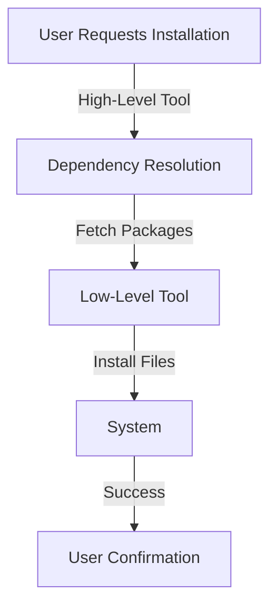

# 📦 Package Management Examples

## 🔹 Introduction
Package management is essential for installing, updating, and removing software on different operating systems. This document covers examples of both **low-level** and **high-level** package management tools.

---

## ⚙️ Common Usage of Low-Level Tools

Low-level tools manage individual packages and provide fine-grained control.

### 🛠 Example Commands
| Command | Description |
|---------|------------|
| `dpkg -i package.deb` | Install a Debian package |
| `rpm -ivh package.rpm` | Install an RPM package |
| `dpkg -r package` | Remove a package |
| `rpm -e package` | Remove an RPM package |
| `dpkg -L package` | List installed package files |
| `rpm -ql package` | List installed package files |

📌 **Note**: These tools do not handle dependencies automatically.

---

## 🔹 Common Usage of High-Level Tools

High-level tools resolve dependencies and simplify package management.

### 🛠 Example Commands

| Command | Description |
|---------|------------|
| `apt install package` | Install a package (Debian-based) |
| `yum install package` | Install a package (Red Hat-based) |
| `zypper install package` | Install a package (openSUSE) |
| `pacman -S package` | Install a package (Arch Linux) |
| `dnf install package` | Install a package (Fedora) |
| `apt remove package` | Remove a package (Debian-based) |
| `yum remove package` | Remove a package (Red Hat-based) |

📌 **Tip**: Use `--help` or `man <command>` to explore additional options.

---

### 🎯 Low-Level vs. High-Level Tools

### 🔄 Package Management Flow

---

## ✅ Best Practices
- Always update the package lists before installing: `apt update` or `yum check-update`.
- Use `--dry-run` to simulate installations without making changes.
- Be cautious with `--force` or `--nodeps` flags; they can break dependencies.
- Remove unused dependencies: `apt autoremove` or `dnf autoremove`.

---

## 📌 Summary Table

| Tool | Type | OS Support |
|------|------|------------|
| `dpkg` | Low-Level | Debian-based |
| `rpm` | Low-Level | Red Hat-based |
| `apt` | High-Level | Debian-based |
| `yum` | High-Level | Red Hat-based |
| `dnf` | High-Level | Fedora |
| `pacman` | High-Level | Arch Linux |

---

## 📖 Conclusion
Understanding package management is crucial for system administration and software development. High-level tools simplify the process, while low-level tools offer more control. Always follow best practices to maintain a stable and secure system.

💡 **Stay updated, use package managers wisely, and keep your system secure!**
